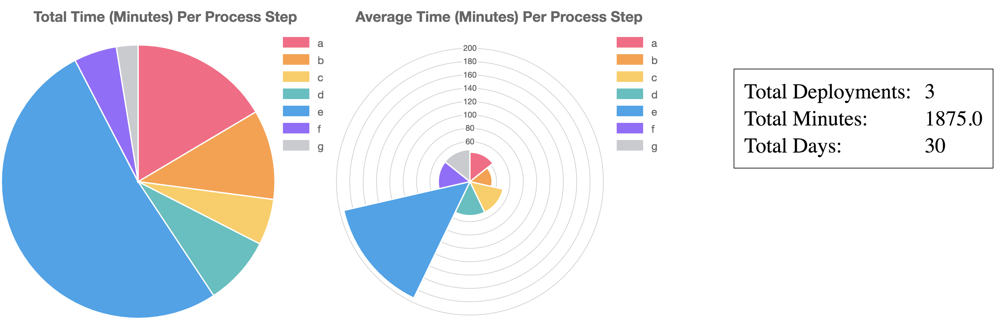
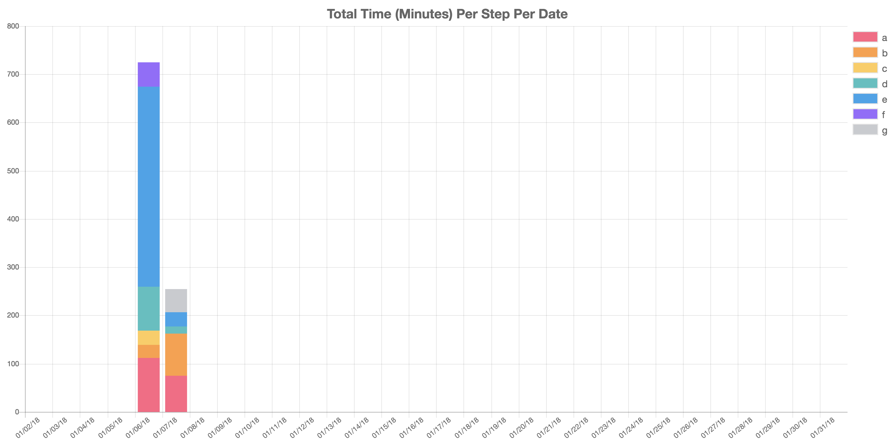

# Deployment Metric Parser

Simple Python configuration to parse Excel files that contain manual steps for executing tasks and
create simple metric outputs for items such as per-process step timings, aggregated errors, and
anything else I can think of including that would be useful in scrutinizing a software-based
deployment that is not yet fully automated.

The idea is to first create a process map detailing each step in the process of executing whatever
is detailed in the playbook. Using each process step, you will tag the lines in the playbook with
the associated step. This utility will then use the process step to map things such as average
timings, deviations, maximum and minimum timings, plots, and whatever other interesting things
may assist with reducing the overall time and variance in the numerous process steps for the
particular task.

## Prerequisites

Install easy_install, pip and virtualenv. Then, clone this repository and navigate to this example:

```bash
$ git clone https://<git_location>/scriptbox.git
$ cd scriptbox/python--deployment-metric-parser
```

Install the required environment and libraries:

```bash
$ virtualenv --no-site-packages --distribute .env
$ source .env/bin/activate
$ pip install -r requirements.txt
```

## Usage

There is an `examples` directory which contains Excel files for playbooks in the format expected
for the parser to operate correctly. The runbook columns should be, in left to right sequence:

* Process Step: Alpha-indicated step in what is a process map detailing all respective steps
for a deployment or activity to take place.
* Task: Numerical/sequence for identification of specific task.
* Step: Command or item to execute.
* Estimated Start Date: Date of the estimated kickoff for the activity.
* Estimated Start Time: When the step is estimated to be kicked off.
* Estimated Stop Time: When the step is estimated to complete.
* Assignee: Person assigned to execute the task.
* Status: String-based indicator of state of the task (complete, in progress, etc.).
* Actual Start Date: Actual date of the kickoff of the activity.
* Actual Start Time: Actual start time of executing the step.
* Actual Stop Time: Actual stop time when the step completed.
* Notes: Aggregate notes, errors, and other useful information to inform the next iteration of
the step in the playbook. Note that this MUST be contained to a single cell in the Excel document.

Additionally, there are some requirements in order for the playbook to work with the parser:

* Playbook must have (minimum) 3 tabs named "Summary", "Playbook", and "Meta" respectively.
* Playbook must follow the same format/fields as exist in the sample playbook in the `examples`
directory.

**WARNING**: This parser will skip *any* rows in a playbook that do not have a process step (first
column) specified - this is a way to protect any extraneous rows and such that are not part of the
actual execution.

Take and make a copy of the playbooks in the `examples` directory and copy them into the `tests`
directory:

```bash
$ cp examples/Playbook_1_Sample.xlsx tests/Playbook1.xlsx
$ cp examples/Playbook_2_Sample.xlsx tests/Playbook2.xlsx
$ cp examples/Playbook_3_Sample.xlsx tests/Playbook3.xlsx
```

**NOTE** If you wish to adjust the dates for the graphs, please edit the `config/settings.yml` file
prior to proceeding. Otherwise, if you're just using the sample playbooks out of the box, the settings
in the `settings.yml` file should suffice.

The utility can be run without any changes to the sample playbooks, but you are free to edit it and
make as many copies/variations of the playbooks as you wish. Once you have a copy of them in the
`tests` directory, go ahead and run the utility:

```bash
$ python gather_metrics.py
```

If all goes well, you should see various metrics that are output to the screen containing what can
be useful information to inform where you should focus your efforts in further automating the manual
steps or focusing on reducing the ovarall variation in the execution process.

## Output Examples

Below are some screenshots of what you can expect to see when you open the `index.html` file generated
by the script in your browser:




## Limitations

This parser is a quick first-cut and can be expanded but has limitations:

* Code probably needs a full rewrite at some point - right now, there is a TON of non-DRY code and
inefficient ways to parse the data. This code can easily be cleaned up/reduced in total line count.
